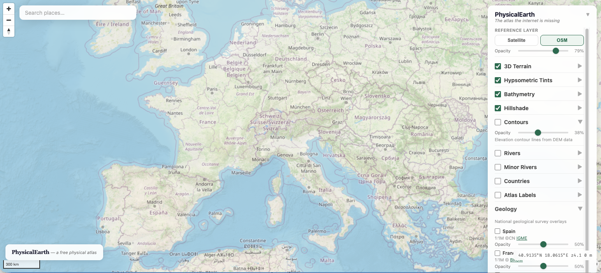

# PhysicalEarth

An interactive physical geography map — hypsometric relief, hillshade, bathymetry, geological overlays, and rivers in a single-file web app.

[**Try it live**](https://jorgemelis.github.io/physicalearth/)

Most online maps are built for navigation. PhysicalEarth is a classic physical atlas — the kind with green lowlands, brown highlands, and blue ocean depths — rendered in the browser with MapLibre GL JS.

## What it does

- **Hypsometric relief**: GPU-rendered elevation-based colors from green lowlands to white peaks, using an 18-point color ramp inspired by classic atlas aesthetics
- **Hillshade**: 3D terrain shading with northwest illumination for natural depth perception
- **Bathymetry**: Ocean depth visualization from EMODnet — see continental shelves, mid-ocean ridges, and deep trenches
- **OpenStreetMap overlay**: Toggle labels, roads, borders, and detail with adjustable transparency
- **Geological layers**: Overlays from national geological surveys:
  - Spain (IGME, 1:1M)
  - France (BRGM, 1:1M)
  - United Kingdom (BGS, 625K Bedrock)
  - Canada (NRCan, compilation)
- **Layer controls**: Adjust transparency of each layer independently via a collapsible panel

## Quick start

Open `index.html` in your browser. No build required.

## Technology

- **MapLibre GL JS 5.19** — GPU-accelerated map rendering with `color-relief` layer support
- **Zero dependencies** — single HTML file, no npm, no build tools, no frameworks
- All external libraries loaded from CDN

## Data sources and attribution

| Source                                             | Data                                     | License               |
| -------------------------------------------------- | ---------------------------------------- | --------------------- |
| [Mapterhorn](https://mapterhorn.com/)              | DEM elevation tiles (Terrarium encoding) | Free                  |
| [EMODnet](https://emodnet.ec.europa.eu/)           | Bathymetry (ocean depth)                 | Free with attribution |
| [OpenStreetMap](https://www.openstreetmap.org/)    | Base map tiles                           | ODbL                  |
| [IGME](https://www.igme.es/)                       | Geological cartography of Spain (1:1M)   | Free with attribution |
| [BRGM](https://www.brgm.fr/)                       | Geological cartography of France (1:1M)  | Free with attribution |
| [BGS/UKRI](https://www.bgs.ac.uk/)                 | Bedrock geology of the UK (625K)         | Free with attribution |
| [NRCan](https://natural-resources.canada.ca/)      | Geological compilation of Canada         | Free with attribution |
| [Natural Earth](https://www.naturalearthdata.com/) | Rivers (10m)                             | Public domain         |

## Roadmap

### Done

- [x] MapLibre GL JS viewer with GPU-rendered hypsometric tints
- [x] 18-point color ramp (ocean depths to alpine peaks)
- [x] Hillshade with adjustable exaggeration
- [x] EMODnet bathymetry layer
- [x] OpenStreetMap overlay with opacity control
- [x] Collapsible layer control panel with per-layer opacity
- [x] Geological overlays: Spain, France, UK, Canada
- [x] Responsive design with mobile toggle
- [x] Live coordinates display
- [x] Rivers layer with labeled, importance-scaled rendering (Natural Earth 10m)
- [x] GitHub Pages deployment

### Planned

- [ ] Geological legends (WMS GetLegendGraphic)
- [ ] Additional geological surveys (Germany, Italy, USGS, OneGeology)
- [ ] Tectonic plate boundaries
- [ ] Mountain range / peak labels (optional atlas overlay)
- [ ] Climate zones layer
- [ ] Custom label styling (atlas-quality typography)
- [ ] Historical map overlays
- [ ] Fix IGME CORS issue (Spain geology)

## Contributing

We'd love your help! See [CONTRIBUTING.md](CONTRIBUTING.md) for guidelines.

Help especially welcome with:

- Improving the hypsometric color ramp
- Integrating WMS services from additional national geological surveys
- MapLibre styling
- Feedback on what layers and features would be most useful

## Credits

Inspired by [Tom Patterson](https://www.shadedrelief.com/)'s cartographic work (US National Park Service, retired). His [Natural Earth](https://www.naturalearthdata.com/) dataset and cross-blended hypsometric tints are foundational to this project.

## License

MIT License. See [LICENSE](LICENSE).

Data sources retain their own licenses — see the attribution table above.
